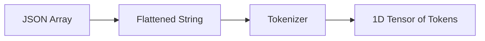

# Chapter 15.3 - Formatting the Chat Dataset

When dealing with a multi-turn chatting dataset like **UltraChat**, we have to prepare the data in a very specific way before our GPT-2 model can learn from it.

:::info[The Actor's Script]
Think of the LLM as an actor reading a script. The script clearly dictates who is speaking ("User" or "Assistant"). If we just jumbled all the text together, the model wouldn't know when it's supposed to listen and when it's supposed to talk!
:::

## 📝 The Raw Data

Our raw dataset provides a conversation as a JSON array of messages:

```json
{
  "messages": [
    {"role": "user", "content": "Hello!"},
    {"role": "assistant", "content": "Hi there! How can I help you?"},
    {"role": "user", "content": "Can you explain tokenization?"}
  ]
}
```

## 🔄 The Transformation

We cannot pass JSON directly into a Neural Network. We must flatten this JSON into a single, continuous string, while inserting special "Control Tokens" to help the model distinguish between speakers.

A common pattern is:

```text
User: Hello!
Assistant: Hi there! How can I help you?
User: Can you explain tokenization?
Assistant: 
```

Notice the trailing `Assistant: ` at the end. We intentionally leave the last assistant response blank when prompting the model, effectively forcing the model to "fill in the blank" by generating the assistant's reply!

## 🔢 Tokenization

Once the text is flattened, we pass it through our tokenizer (using Byte Pair Encoding). 



This 1-dimensional tensor of tokens is exactly what we feed into our GPT-2 model. But before we start calculating loss, there is a critical step we must perform to ensure the model doesn't try to predict the user's text... which we will cover in the next chapter on the **Collate Function**!


---

## 💻 Code Implementation

Here is the exact PyTorch implementation for the concepts discussed above:

```python
import torch
from torch.utils.data import Dataset


# ============================================================
# Common Chat Formatting
# ============================================================

USER_PREFIX = "User:\n"
ASSISTANT_PREFIX = "Assistant:\n"
SEPARATOR = "\n\n"


# ============================================================
# Chat Formatting
# ============================================================

def format_chat(example):

    prompt = ""

    for message in example["messages"]:

        if message["role"] == "user":
            prompt += f"User:\n{message['content']}\n\n"

        elif message["role"] == "assistant":
            prompt += f"Assistant:\n{message['content']}\n\n"

    return prompt


# ============================================================
# Chat Dataset
# ============================================================

class ChatDataset(Dataset):
    def __init__(
        self,
        data,
        tokenizer,
        max_length=1024,      # vram issue: enforce model context length inside dataset
        stride=1024           # vram issue: use 512 for overlapping sliding windows
    ):

        self.data = data

        # Cache commonly used token sequences
        self.user_prefix_tokens = tokenizer.encode(USER_PREFIX)
        self.assistant_prefix_tokens = tokenizer.encode(ASSISTANT_PREFIX)
        self.separator_tokens = tokenizer.encode(SEPARATOR)
        self.eos_token = tokenizer.eot_token

        # Store token ids and assistant loss masks
        self.input_ids = []
        self.loss_masks = []

        for entry in data:

            tokens = []
            loss_mask = []

            for message in entry["messages"]:

                role = message["role"].lower()

                if role == "user":

                    prefix_tokens = self.user_prefix_tokens

                    content_tokens = tokenizer.encode(
                        message["content"],
                        allowed_special={"<|endoftext|>"}
                    )

                    separator_tokens = self.separator_tokens

                    tokens.extend(prefix_tokens)
                    tokens.extend(content_tokens)
                    tokens.extend(separator_tokens)

                    # Ignore user prompt
                    loss_mask.extend([0] * len(prefix_tokens))

                    # Ignore user text
                    loss_mask.extend([0] * len(content_tokens))

                    # Ignore separator
                    loss_mask.extend([0] * len(separator_tokens))

                elif role == "assistant":

                    prefix_tokens = self.assistant_prefix_tokens

                    content_tokens = tokenizer.encode(
                        message["content"],
                        allowed_special={"<|endoftext|>"}
                    )

                    separator_tokens = self.separator_tokens

                    tokens.extend(prefix_tokens)
                    tokens.extend(content_tokens)
                    tokens.extend(separator_tokens)

                    # Ignore assistant prefix
                    loss_mask.extend([0] * len(prefix_tokens))

                    # Train only on assistant response
                    loss_mask.extend([1] * len(content_tokens))

                    # Ignore separator
                    loss_mask.extend([0] * len(separator_tokens))

                else:
                    raise ValueError(f"Unknown role: {role}")

            # Append EOS
            tokens.append(self.eos_token)
            loss_mask.append(1)

            # =======================================================
            # vram issue: Split long conversations into fixed-size
            # windows instead of storing one huge 35k-token sample.
            # =======================================================

            start = 0

            while start < len(tokens):

                end = start + max_length

                chunk_tokens = tokens[start:end]
                chunk_loss_mask = loss_mask[start:end]

                # Skip empty chunks
                if len(chunk_tokens) == 0:
                    break

                self.input_ids.append(chunk_tokens)
                self.loss_masks.append(chunk_loss_mask)

                if end >= len(tokens):
                    break

                start += stride

    def __getitem__(self, index):

        return {
            "input_ids": self.input_ids[index],
            "loss_mask": self.loss_masks[index],
        }

    def __len__(self):
        return len(self.input_ids)      # vram issue: dataset now contains chunked samples instead of original conversations
```
