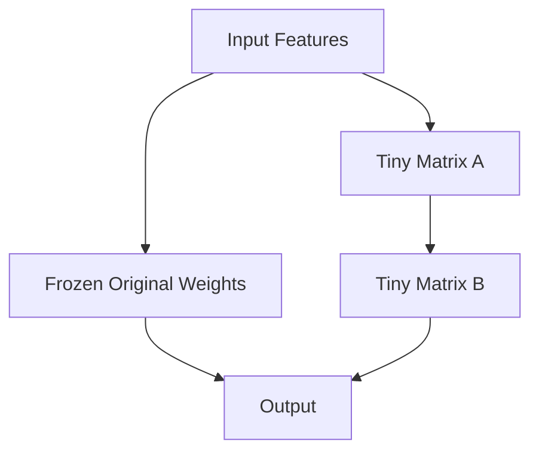

# Chapter 16.1 - FineTuning Improvements

Training large language models requires vast amounts of memory and computational power. In this chapter, we will explore some of the most critical, industry-standard improvements used to dramatically speed up fine-tuning and reduce VRAM requirements.

---

## 📉 1. Gradient Accumulation

If you are fine-tuning a model on a consumer GPU (like an RTX 3090 with 24GB of VRAM), you might find that you can only fit a `batch_size` of 1 or 2 before running out of memory. Small batch sizes lead to unstable gradients and terrible training results.

**Gradient Accumulation** allows you to simulate a massive batch size!
Instead of updating the model weights after every tiny batch, you:
1. Run a forward and backward pass for a small batch (e.g. size 2).
2. Save (accumulate) the gradients in memory.
3. Repeat this 10 times.
4. On the 10th time, run the optimizer step to update the weights!

You have just successfully simulated a `batch_size` of 20, without needing 10x the VRAM!

---

## 🧠 2. LoRA (Low-Rank Adaptation)

Updating all 1.5 Billion parameters of a GPT model is incredibly expensive.

**LoRA** is a genius mathematical trick. Instead of updating the massive, original weight matrices, we freeze them completely. We then inject two tiny, new matrices (A and B) alongside the original weights. During fine-tuning, we *only* train these tiny matrices!

Because matrices A and B are extremely small (low-rank), we reduce the number of trainable parameters by over 99%! This allows you to fine-tune massive models on a single GPU.