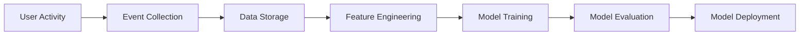
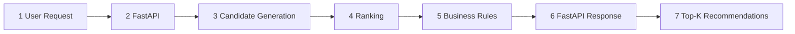

There are 3 different flows happening. 
	1- High Level Diagram and connection with BigKart Application
	2- Low level Diagram to show inner architecture inside Recommendation Microservice
	3- Training pipeline for how a model trains and updates based on user's actions

## High Level Diagram and Connection with BigKart

## Training Pipeline

## Generation working Pipeline

## Inner working Pipeline (During Generation-Ranking-Business Rules)

```mermaid
flowchart LR
    A[FastAPI Endpoint] --> B[Validate Request]
    B --> C[Extract User ID]
    C --> D[Load User Context]

    D --> E[Generate Candidates]

    E --> E1[Get User History]
    E --> E2[Get Similar Items]
    E --> E3[Get Popular Items]
    E --> E4[Apply Candidate Sources]

    E1 --> F[Merge Candidates]
    E2 --> F
    E3 --> F
    E4 --> F

    F --> G[Remove Duplicates]
    G --> H[Filter Unavailable Products]
    H --> I[Filter Already Purchased Products]

    I --> J[Build Ranking Features]
    J --> J1[User Features]
    J --> J2[Product Features]
    J --> J3[Interaction Features]
    J --> J4[Context Features]

    J1 --> K[Ranking Model]
    J2 --> K
    J3 --> K
    J4 --> K

    K --> L[Generate Scores]
    L --> M[Sort by Score]
    M --> N[Apply Business Rules]
    N --> N1[Inventory Rules]
    N --> N2[Category Rules]
    N --> N3[Diversity Rules]
    N --> N4[Business Constraints]

    N1 --> O[Final Ranking]
    N2 --> O
    N3 --> O
    N4 --> O

    O --> P[Select Top-K]
    P --> Q[Build Response]
    Q --> R[FastAPI Response]
```

  