# Scalable AI Recommendation System

> **Project Objective:** Design and deploy a scalable AI recommendation system combining **KNN-based candidate retrieval** with **rank-fusion re-ranking**, targeting **10K+ daily active users** and a **35% CTR improvement**.

:::warning
If **10K+ DAU** and **35% CTR lift** are not real measured results, describe them as **targets** rather than achieved results on a resume.
:::

---

## 1. What Problem Are We Solving?

An e-commerce platform may have thousands or millions of products.

When a customer opens the application, we need to answer:

> **"Which products should we show this customer right now?"**

Showing every product is impossible.

Instead, the recommendation system:

```text
Customer
   ↓
Understand customer interests
   ↓
Retrieve relevant products
   ↓
Rank the products
   ↓
Show the best recommendations
```

The goal is to show products that are:

- relevant to the customer's interests
- similar to products they interacted with
- popular when appropriate
- strongly supported by their behavior
- ranked highly enough to increase the probability of a click

---

## 2. High-Level Architecture

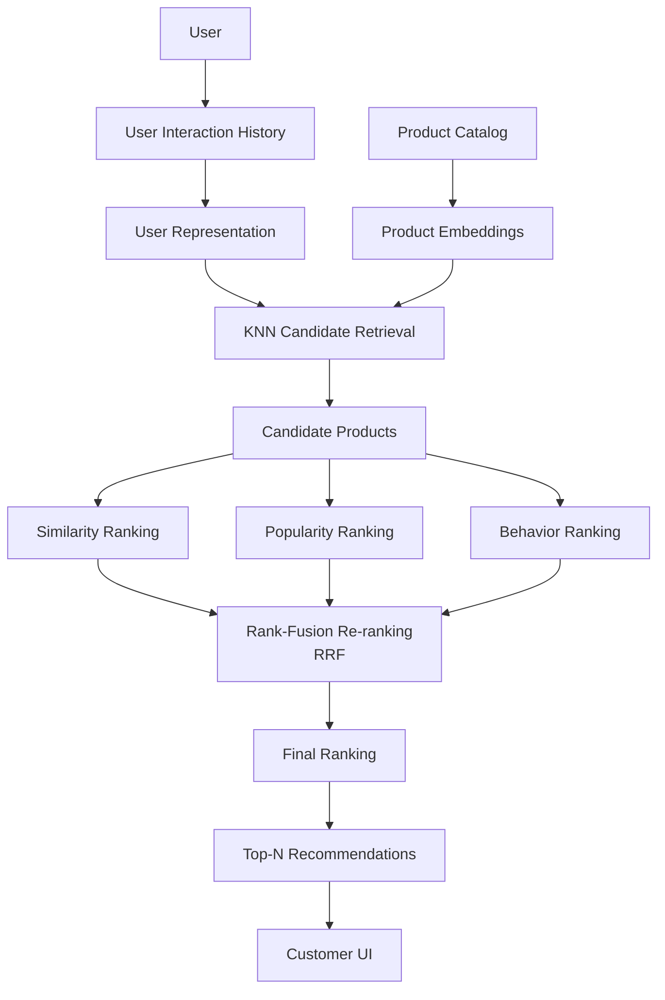

The architecture has two major recommendation stages:

### Retrieval

Find a manageable set of potentially relevant products.

### Re-ranking

Take those candidates and determine which ones should appear first.

---

## 3. Product Representation

A recommendation system needs a numerical representation of products.

Represent every product as a vector:

```text
Product → Vector
```

For example:

```text
iPhone 15
→ [0.90, 0.80, 0.10, ...]
```

The dimensions can represent learned semantic/product characteristics.

In a real system, these vectors would generally come from an embedding model rather than being manually created.

The important property is:

> **Similar products should have nearby representations in vector space.**

For example:

```text
iPhone
Samsung Galaxy
Google Pixel
```

should be closer to one another than to:

```text
MacBook
```

or:

```text
Headphones
```

---

## 4. User Representation

The system also needs to represent the customer's interests.

Suppose the customer has interacted with:

```text
iPhone
AirPods
iPad
MacBook
```

We can construct a user representation from these interactions.

A simple baseline is:

```text
User Vector
=
average(product vectors from interaction history)
```

Conceptually:

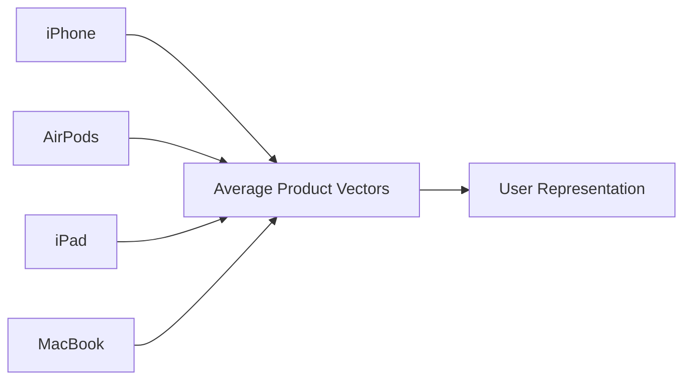

The resulting vector represents the customer's observed interests.

In a production system, this can be made more sophisticated using:

- interaction weights
- recency
- purchase vs. click signals
- session behavior
- learned user embeddings
- sequence models

---

## 5. Why Do We Need Retrieval?

Imagine the catalog contains:

```text
10,000,000 products
```

We don't want the ranking system to perform expensive ranking operations over all 10 million products for every request.

Instead:

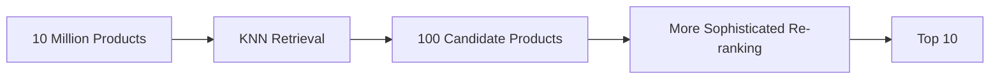

KNN acts as a **candidate retrieval mechanism**.

It reduces the search space.

---

## 6. KNN Candidate Retrieval

KNN means:

> **K-Nearest Neighbors**

Given a user vector, KNN searches for product vectors that are closest to it.

Conceptually:

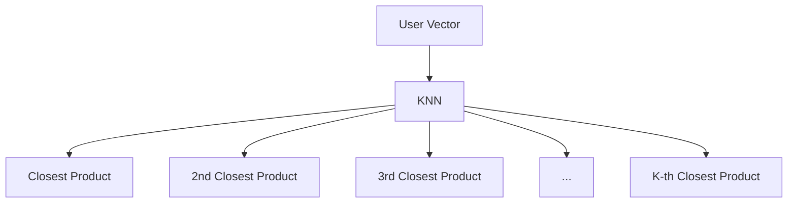

The closest products become candidates.

For example:

```text
User
 ↓
KNN
 ↓
P12
P43
P87
P102
P145
...
```

These products are not necessarily the final recommendations.

They are **candidates**.

---

## 7. Distance and Similarity

KNN needs a way to determine how close two vectors are.

One common choice is **cosine similarity/distance**.

Cosine similarity measures the orientation of vectors rather than simply their absolute magnitude.

Conceptually:

```text
High similarity
      ↓
Vectors point in similar directions

Low similarity
      ↓
Vectors point in different directions
```

If KNN returns cosine distance:

```text
smaller distance
      ↓
more similar
```

A simple transformation is:

```python
similarity = 1 - distance
```

for the cosine-distance convention used by the implementation.

---

## 8. Candidate Retrieval vs. Ranking

This distinction is extremely important.

### KNN answers:

> **"Which products are worth considering?"**

### Re-ranking answers:

> **"Which of these candidates should appear first?"**

Therefore:

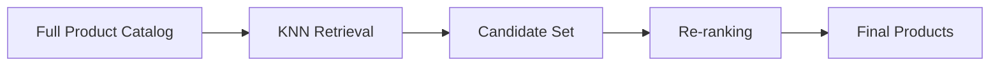

KNN is therefore the **retrieval layer**, not the entire recommendation system.

---

## 9. Multiple Recommendation Signals

A single similarity score may not be enough.

A product can be highly similar to the customer but:

- rarely purchased
- temporarily unpopular
- poorly aligned with recent behavior
- less useful than another candidate

Therefore, the system can create multiple rankings.

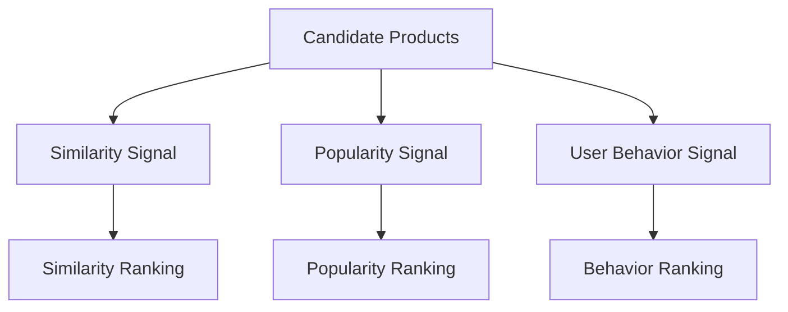

Each ranking represents a different view of the candidate set.

---

## 10. Similarity Ranking

The first ranking uses the KNN similarity score.

It answers:

> **"Which candidates are most similar to this customer's interests?"**

Example:

```text
1. Product A
2. Product B
3. Product C
4. Product D
5. Product E
```

This is particularly useful for:

- similar products
- personalized product discovery
- "customers who viewed this may also like..."
- semantic product matching

---

## 11. Popularity Ranking

A second ranking can use popularity.

Popularity can be derived from signals such as:

- purchases
- clicks
- views
- conversion rate
- recent demand

Conceptually:

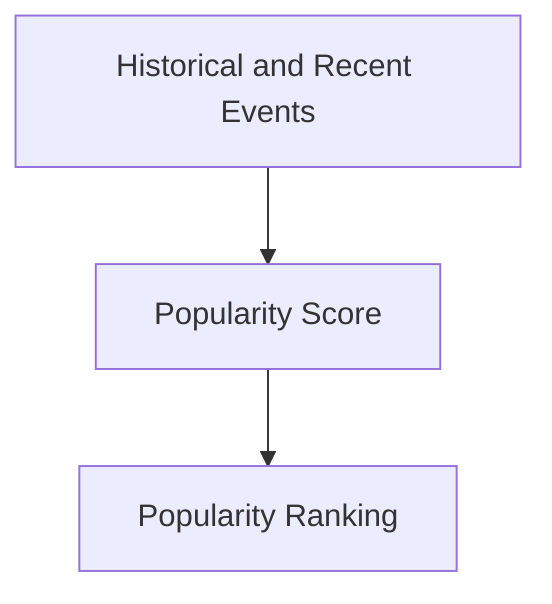

This provides a different perspective from pure similarity.

For example:

```text
Similarity says:

A
B
C
D

Popularity says:

C
A
D
B
```

Neither ranking necessarily has to be considered "wrong."

They are answering different questions.

---

## 12. User-Behavior Ranking

The system can also calculate a user-specific behavioral relevance score.

For example, the customer may have:

- repeatedly viewed smartphones
- purchased Apple accessories
- recently searched for headphones
- added electronics to their cart

The behavioral signal tries to answer:

> **"Given this customer's behavior, which candidate appears most relevant?"**

This creates another ranking.

```text
Behavior ranking:

B
D
A
C
```

---

## 13. Why Multiple Rankings?

Suppose three ranking systems produce:

```text
Similarity:

A
B
C
D


Popularity:

C
A
D
B


Behavior:

B
D
A
C
```

There is no single obvious winner.

Instead, we want to combine the evidence.

This is where **rank fusion** comes in.

---

## 14. Rank Fusion

Rank fusion combines multiple ranked lists into one ranking.

Instead of attempting to directly compare completely different scores:

```text
similarity score
popularity score
behavior score
```

we can work with their **rank positions**.

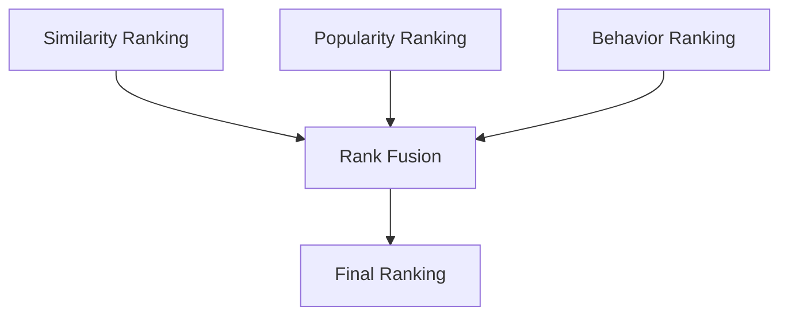

One method is:

> **Reciprocal Rank Fusion (RRF)**

---

## 15. Reciprocal Rank Fusion

RRF assigns a score based on where an item appears in each ranking.

The formula is:

$$
RRF(d)=
\sum_i
\frac{1}{k+rank_i(d)}
$$

Where:

- $d$ = product
- $i$ = ranking system
- $rank_i(d)$ = product's position in that ranking
- $k$ = smoothing constant

The scores from all rankings are added together.

---

## 16. Why Not Just Use `1 / rank`?

We could technically use:

$$
\frac{1}{rank}
$$

But this makes rank position extremely influential.

For example:

```text
Rank 1 → 1.000
Rank 2 → 0.500
Rank 5 → 0.200
Rank 10 → 0.100
```

The difference between rank 1 and rank 10 is huge.

A single #1 position can dominate the combined result.

---

## 17. What Does `k` Do?

RRF instead uses:

$$
\frac{1}{k+rank}
$$

For example, with:

```text
k = 60
```

we get:

```text
Rank 1  → 1/61 ≈ 0.01639
Rank 4  → 1/64 ≈ 0.01563
Rank 10 → 1/70 ≈ 0.01429
```

The differences are much smaller.

Therefore, `k` reduces the influence of the exact rank position.

It makes RRF more interested in:

> **consistent presence near the top across multiple rankings**

rather than:

> **being #1 in one ranking.**

---

## 18. Consistency vs. One Excellent Ranking

Consider two products.

### Product A

```text
Similarity → #1
Popularity → #10
```

A is extremely strong according to one signal but weak according to another.

### Product B

```text
Similarity → #4
Popularity → #4
```

B is consistently strong.

### Without `k`

Using:

$$
1/rank
$$

Product A:

$$
1/1 + 1/10
= 1.10
$$

Product B:

$$
1/4 + 1/4
= 0.50
$$

Result:

```text
A → recommended
B → not recommended
```

The #1 ranking dominates.

### With `k = 60`

Product A:

$$
1/61 + 1/70
\approx 0.03068
$$

Product B:

$$
1/64 + 1/64
\approx 0.03125
$$

Result:

```text
B → recommended
A → not recommended
```

Now the consistently strong product wins.

---

## 19. The Core Idea Behind `k`

`k` does **not** change the original rankings.

It changes how strongly rank positions influence the **combined ranking**.

Think of it as a smoothing parameter:

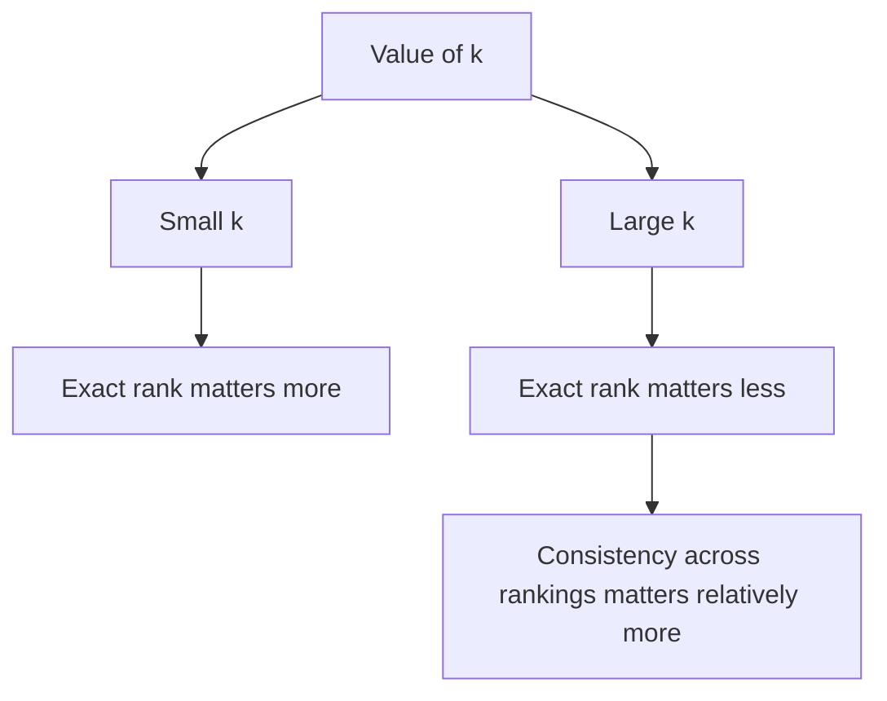

The commonly used RRF formulation uses `k = 60`, but `k` is a configurable hyperparameter rather than a random number.

---

## 20. Final Ranking

After calculating RRF scores:

```text
Product A → 0.0481
Product B → 0.0478
Product C → 0.0469
Product D → 0.0452
```

we sort by the fused score.

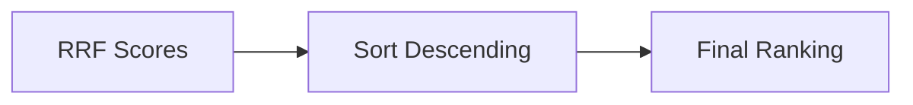

---

## 21. Top-N Recommendation

The final system doesn't need to return every candidate.

It can return:

```text
Top 3
```

or:

```text
Top 5
```

or:

```text
Top 10
```

depending on the product experience.

For example:

```text
1. Product B
2. Product A
3. Product D
```

These are what the customer sees.

---

## 22. End-to-End Pipeline

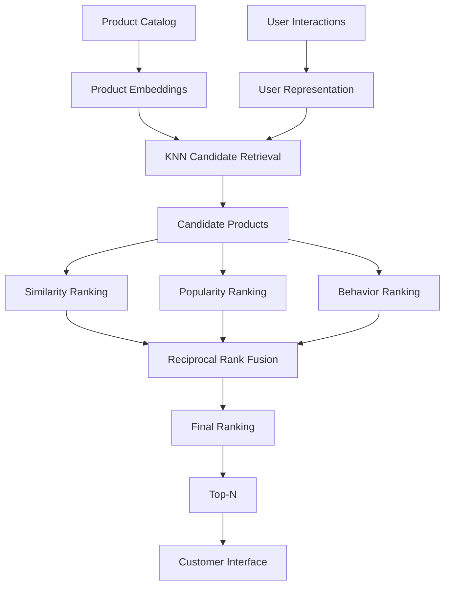

---

## 23. Why This Architecture Is Scalable

The main idea is to separate **retrieval** from **ranking**.

Instead of:

```text
10 million products
       ↓
expensive ranking
       ↓
top 10
```

we do:

```text
10 million products
       ↓
fast vector retrieval
       ↓
100 candidates
       ↓
more sophisticated ranking
       ↓
top 10
```

This allows the expensive ranking logic to operate on a much smaller set.

As the catalog grows, this separation becomes increasingly important.

---

## 24. Serving Architecture

A production deployment can expose the recommender through an API.

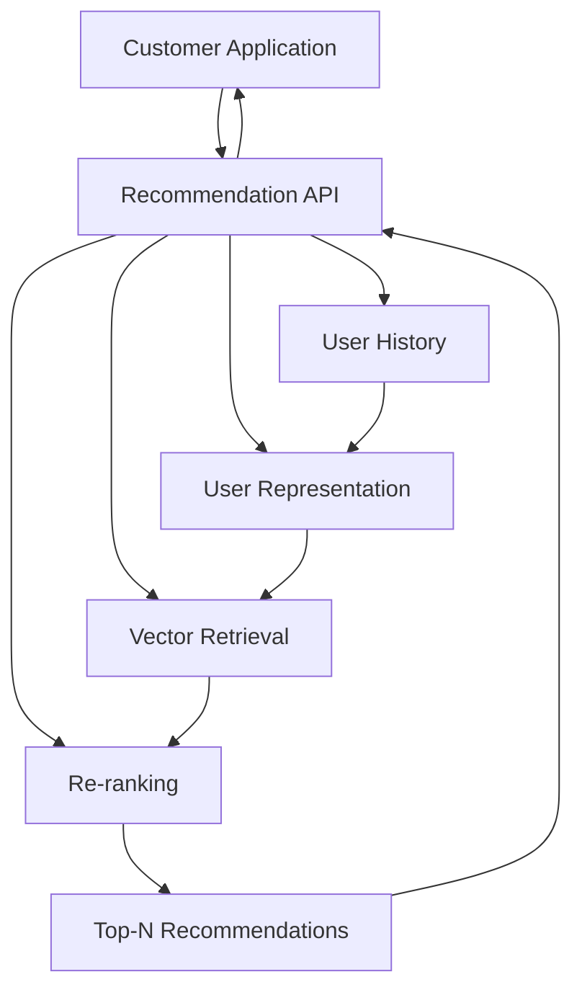

Example conceptual request:

```text
GET /recommendations?user_id=U123
```

Response:

```json
{
  "user_id": "U123",
  "recommendations": [
    "P42",
    "P87",
    "P15"
  ]
}
```

---

## 25. Production Data Flow

A realistic system separates online serving from offline processing.

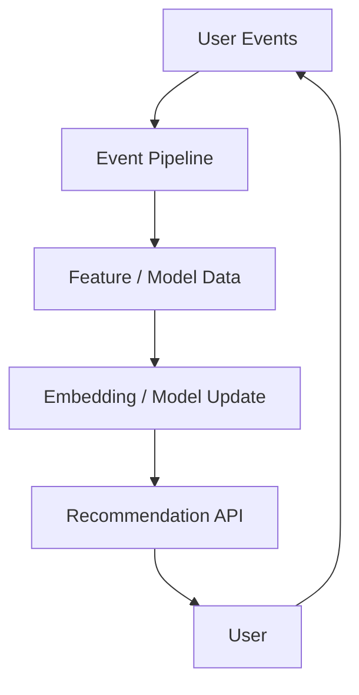

Typical user events include:

- click
- view
- search
- add to cart
- purchase

This allows recommendations to improve as new interaction data arrives.

---

## 26. Measuring Recommendation Quality

The system should not be evaluated only by whether it produces recommendations.

We need measurable business outcomes.

### CTR

$$
CTR =
\frac{clicks}{impressions}
$$

It answers:

> **"How often do users click recommended products?"**

### Conversion Rate

$$
CVR =
\frac{conversions}{clicks}
$$

It answers:

> **"How often does a click result in a conversion?"**

### Revenue per User

Measures the business impact of recommendations.

---

## 27. A/B Testing

To claim a CTR improvement, we need an experiment.

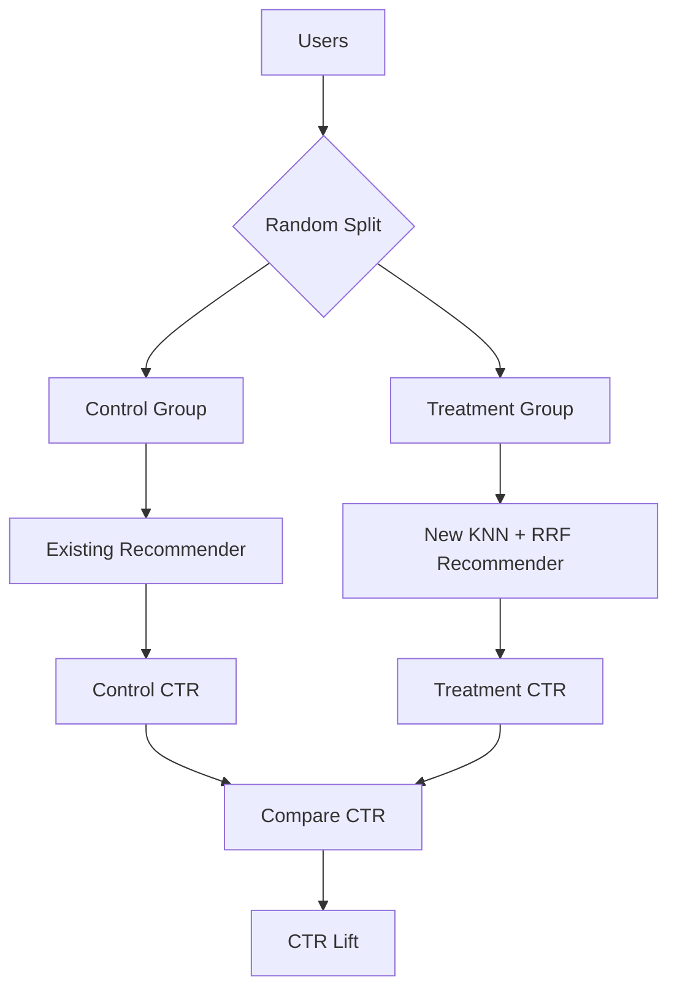

A claimed:

> **35% CTR lift**

should mean a measured relative improvement such as:

$$
CTR_{new}
=
1.35 \times CTR_{baseline}
$$

For example:

```text
Baseline CTR = 10%

New CTR = 13.5%

Relative lift = 35%
```

This is different from saying the CTR itself is 35%.

---

## 28. Scale Target

The system is designed around a target of:

> **10K+ daily active users**

This means the serving architecture must be able to handle recommendation requests from a significant number of daily users while maintaining acceptable latency.

The important architectural principle is:

```text
Offline computation
       +
Efficient online retrieval
       +
Lightweight online ranking
```

rather than performing expensive model computation from scratch for every request.

---

## 29. What Each Component Does

| Component | Responsibility |
|---|---|
| Product embeddings | Represent products numerically |
| User representation | Represent customer interests |
| KNN | Retrieve potentially relevant candidates |
| Similarity ranking | Rank by vector relevance |
| Popularity ranking | Rank by popularity |
| Behavior ranking | Rank by user-specific behavior |
| RRF | Fuse multiple rankings |
| Top-N | Select products shown to customer |
| API | Serve recommendations |
| A/B testing | Measure business impact |

---

## 30. The Most Important Mental Model

Remember these three questions:

### 1. Retrieval

> **"What products should I consider?"**

KNN answers this.

### 2. Re-ranking

> **"Which of those candidates should appear first?"**

Multiple ranking signals answer this.

### 3. Rank fusion

> **"How do I combine those different opinions?"**

RRF answers this.

So the complete recommendation strategy is:

> **Vector-based KNN candidate retrieval followed by multi-signal rank-fusion re-ranking.**

---

## 31. Resume-Level Description

If the **35% CTR lift is actually measured**, it can be stated directly:

> **Designed and deployed a scalable AI recommendation system combining KNN-based candidate retrieval with RRF re-ranking, serving 10K+ daily active users and achieving a 35% CTR lift.**

If it is only a target and not measured, use:

> **Designed and deployed a scalable AI recommendation system combining KNN-based candidate retrieval with RRF re-ranking, targeting 10K+ daily active users and improved CTR through multi-signal personalization.**

---

## 32. What You Should Be Able to Explain in an Interview

For a one-day preparation window, focus on these seven things:

1. **Why represent products as vectors?**
2. **How do we turn user history into a user vector?**
3. **Why use KNN?**
4. **Why is KNN retrieval rather than the final ranking?**
5. **Why do we have similarity, popularity, and behavior rankings?**
6. **Why use RRF instead of simply adding unrelated scores?**
7. **What does `k` do, and why can consistency beat being #1 in only one ranking?**

If you can explain those clearly, you understand the core of the project rather than merely knowing the code.
