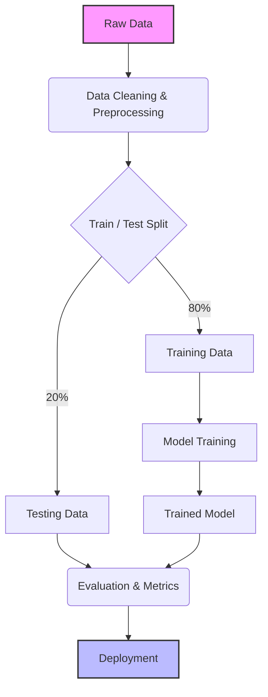

# 🔄 The ML Workflow

Building a Machine Learning model isn't just writing code—it's a whole lifecycle!

## 1. 🧹 Data Collection & Cleaning
**"Garbage In, Garbage Out."** Cleaning the data usually takes up 80% of an ML Engineer's time!

## 2. ✂️ Train/Test Split
Imagine a student studying for a test. You give them practice questions (Training), and test them on questions they have *never seen before* (Testing). 

## 🐍 Python Implementation

We use `scikit-learn` for almost all classical ML workflows!

```python
from sklearn.model_selection import train_test_split
import numpy as np

# X = Features (e.g. house size), y = Labels (e.g. house price)
X = np.array([[1000], [1500], [2000], [2500], [3000]])
y = np.array([100k, 150k, 200k, 250k, 300k])

# Split 80% for training, 20% for testing
X_train, X_test, y_train, y_test = train_test_split(X, y, test_size=0.2, random_state=42)

print("Training Data size:", len(X_train))
print("Testing Data size:", len(X_test))
```

## 🗺️ Visualizing the Workflow


