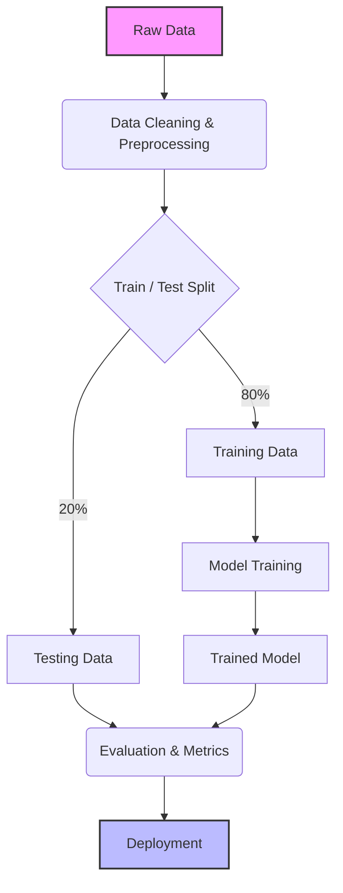

# 🔄 The ML Workflow

Building a Machine Learning model isn't just writing code—it's a whole lifecycle!

## 1. 🧹 Data Collection & Cleaning
**"Garbage In, Garbage Out."** Cleaning the data usually takes up 80% of an ML Engineer's time!

## 2. ✂️ Train/Test Split
Imagine a student studying for a test. You give them practice questions (Training), and test them on questions they have *never seen before* (Testing). 

## 🐍 Python Implementation

We can split dataset features into Training and Testing sets seamlessly!

<PyScriptRunner
  title="Train / Test Split Playground"
  initialCode={`import numpy as np

# X = Features (e.g. house size), y = Labels (e.g. house price in $k)
X = np.array([1000, 1500, 2000, 2500, 3000])
y = np.array([100, 150, 200, 250, 300])

# 80/20 Train-Test Split using NumPy random indexing
indices = np.arange(len(X))
np.random.seed(42)
np.random.shuffle(indices)

train_size = int(0.8 * len(X))
train_idx, test_idx = indices[:train_size], indices[train_size:]

X_train, X_test = X[train_idx], X[test_idx]
y_train, y_test = y[train_idx], y[test_idx]

print("X_train (Training features):", X_train)
print("y_train (Training labels):  ", y_train)
print("X_test  (Testing features): ", X_test)
print("y_test  (Testing labels):   ", y_test)
print(f"Train Dataset Size: {len(X_train)} | Test Dataset Size: {len(X_test)}")
`}
/>

## 🗺️ Visualizing the Workflow

