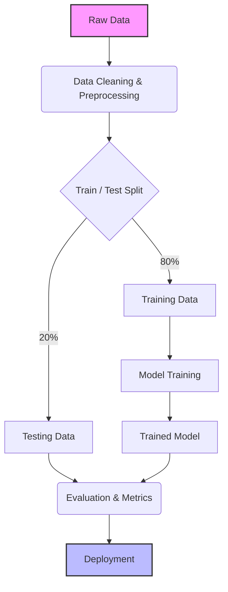

# 🔄 The ML Workflow

Building a Machine Learning model isn't just writing code—it's a whole lifecycle!

## 1. 🧹 Data Collection & Cleaning
**"Garbage In, Garbage Out."** Cleaning the data usually takes up 80% of an ML Engineer's time!

## 2. ✂️ Train/Test Split
Imagine a student studying for a test. You give them practice questions (Training), and test them on questions they have *never seen before* (Testing). 

## 🐍 Python Implementation

We can split dataset features into Training and Testing sets seamlessly!

<PyScriptRunner
  title="Train / Test Split Visualizer"
  initialCode={`import numpy as np
import matplotlib.pyplot as plt

# Generate 20 synthetic house data points
np.random.seed(42)
X = np.sort(np.random.uniform(1000, 4000, 20))
y = 0.08 * X + np.random.normal(0, 15, 20)

# 80/20 Train-Test Split using random indexing
indices = np.arange(len(X))
np.random.shuffle(indices)

train_size = int(0.8 * len(X))
train_idx, test_idx = indices[:train_size], indices[train_size:]

X_train, X_test = X[train_idx], X[test_idx]
y_train, y_test = y[train_idx], y[test_idx]

print("Train Dataset Size: %d points (80%%)" % len(X_train))
print("Test Dataset Size:  %d points (20%%)" % len(X_test))

# --- Plotting Section (Intercepted for Chart.js) ---

# 1. Training Set Scatter Points
plt.scatter(X_train, y_train, label="Training Set (80% - Model Learns From This)")

# 2. Testing Set Scatter Points
plt.scatter(X_test, y_test, label="Test Set (20% - Unseen Evaluation)")

# Axis Labels & Title
plt.xlabel("House Size (sqft)")
plt.ylabel("House Price ($1k)")
plt.title("80 / 20 Train vs Test Data Split")
`}
/>

## 🗺️ Visualizing the Workflow

