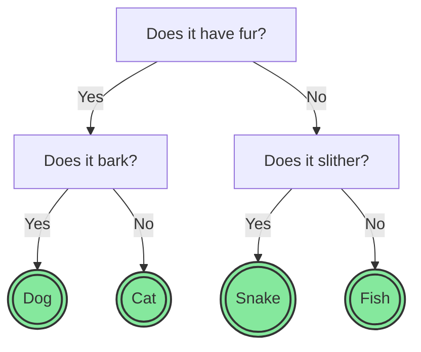

# 🌳 Decision Trees

Decision Trees model how humans naturally make decisions.

## ❓ The 20 Questions Game
It asks the absolute best Yes/No questions to separate the data as fast as possible. However, they easily memorize the data (overfit) if they grow too deep.

## 🐍 Python Implementation

```python
from sklearn.tree import DecisionTreeClassifier

X = [[0, 0], [1, 1], [9, 9], [10, 10]]
y = [0, 0, 1, 1]

# max_depth stops the tree from memorizing too much!
tree = DecisionTreeClassifier(max_depth=3)
tree.fit(X, y)

print("Prediction:", tree.predict([[2, 2]]))
```

## 🗺️ Visualizing a Decision Tree


