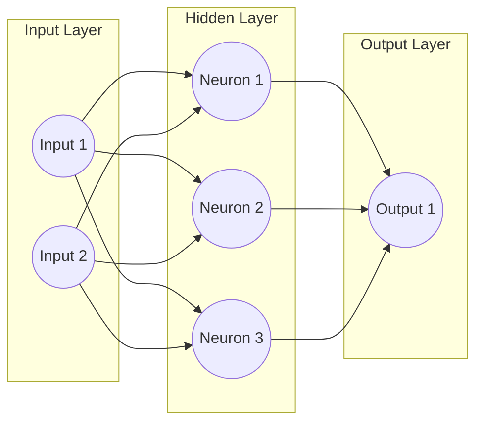

# 🌐 Multi-Layer Perceptron (MLP)

If a neuron is an ant, the MLP is the whole ant colony.

## 🍰 The Layer Cake
An MLP organizes neurons into layers:
1. **Input Layer:** The raw data (e.g. pixels of an image).
2. **Hidden Layers:** Where the magic happens. Layer 1 might look for edges. Layer 2 combines edges into shapes. Layer 3 combines shapes into a face.
3. **Output Layer:** The final guess (e.g. "It's a Dog!").

## 🐍 Python Implementation

Notice how we use the exact same concepts (`weights`, `bias`, `forward`) from our single neuron, but now we use PyTorch's `nn.Linear` which is just a massive block of neurons working together!

```python
import torch
import torch.nn as nn

class SimpleNeuralNetwork(nn.Module):
    def __init__(self, input_size, hidden_size, output_size):
        super().__init__()
        # Layer 1: A colony of 'hidden_size' neurons
        self.layer1 = nn.Linear(input_size, hidden_size)
        
        # Layer 2: The final output neurons
        self.layer2 = nn.Linear(hidden_size, output_size)
        
    def forward(self, x):
        # 1. Pass through Layer 1 and apply the ReLU bouncer
        hidden_state = torch.relu(self.layer1(x))
        
        # 2. Pass to final output layer
        final_output = self.layer2(hidden_state)
        return final_output

# A network to predict 2 categories (Dog/Cat) from 10 inputs
model = SimpleNeuralNetwork(input_size=10, hidden_size=64, output_size=2)
sample_data = torch.randn(1, 10) # 1 row, 10 features

print("Network Guess [Dog Score, Cat Score]:", model.forward(sample_data))
```

## 🗺️ Visualizing the MLP


