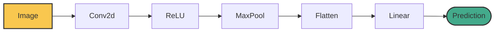

# 🏗️ CNN Architecture

How do we combine Convolutions and Pooling to build a full Convolutional Neural Network (CNN)?

## 🧅 The Onion
1. **Conv + Pool:** Find edges, shrink image.
2. **Conv + Pool:** Combine edges into shapes, shrink image.
3. **Conv + Pool:** Combine shapes into faces, shrink image.
4. **Flatten:** Take the final tiny image and unroll it into a flat 1D Vector.
5. **Linear (MLP):** Feed the vector into standard neurons to make the final guess (e.g. "It's a Dog!").

## 🐍 Python Implementation

Notice how we reuse the `forward()` structure from Course 3!

```python
import torch
import torch.nn as nn

class SimpleCNN(nn.Module):
    def __init__(self):
        super().__init__()
        # Feature Extraction
        self.conv1 = nn.Conv2d(3, 16, kernel_size=3, padding=1)
        self.pool = nn.MaxPool2d(2)
        
        # Classification
        # 16 channels * 32 * 32 (since the 64x64 image was pooled once)
        self.fc = nn.Linear(16 * 32 * 32, 2) # 2 outputs (Cat/Dog)
        
    def forward(self, x):
        # 1. Flashlight
        x = torch.relu(self.conv1(x))
        # 2. Shrink
        x = self.pool(x)
        # 3. Flatten!
        x = torch.flatten(x, start_dim=1)
        # 4. Final Guess
        x = self.fc(x)
        return x

model = SimpleCNN()
dummy_img = torch.randn(1, 3, 64, 64)
print("Final Guess:", model(dummy_img).shape) # (1, 2)
```

## 🗺️ Visualizing the CNN Pipeline


