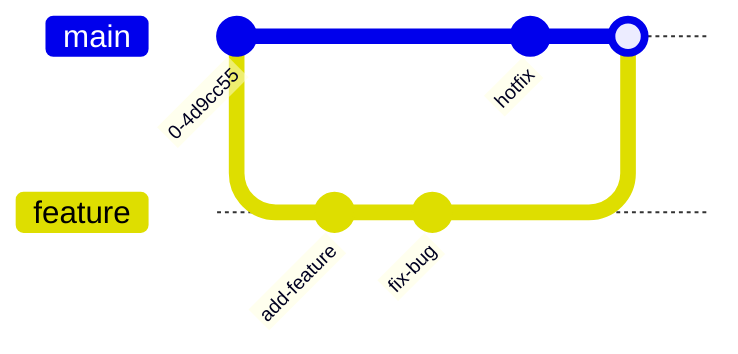

A **Git branch** is a lightweight, movable pointer to a specific commit in your project's version history. It represents an independent line of development, allowing you to diverge from the main codebase to work on features, bug fixes, or experiments in isolation without affecting the original (often called `main` or `master`) branch.

### Key Concepts
*   **Isolation:** When you work on a branch, your changes do not impact other branches until you decide to merge them.
*   **Lightweight:** Unlike other version control systems that may copy entire directories, Git branches are simply references to a commit. This makes creating and switching branches extremely fast.
*   **Merging:** Once your work on a branch is complete and tested, you can merge it back into your main branch to incorporate those changes into the primary codebase.

### Common Git Branch Commands
Below are the most frequently used commands for managing branches:

| Goal | Command |
| :--- | :--- |
| **List branches** | `git branch` (or `git branch -a` for all) |
| **Create a new branch** | `git branch <branch-name>` |
| **Switch to a branch** | `git checkout <branch-name>` or `git switch <branch-name>` |
| **Create and switch to a branch** | `git checkout -b <branch-name>` or `git switch -c <branch-name>` |
| **Merge a branch** | `git merge <branch-name>` (while on the target branch) |
| **Rename a branch** | `git branch -m <new-name>` |
| **Delete a branch** | `git branch -d <branch-name>` |

### Why Use Branches?
*   **Parallel Development:** Multiple developers can work on different features simultaneously without stepping on each other's toes.
*   **Safe Experimentation:** You can try out new ideas or refactor code in a branch; if it doesn't work, you can simply delete the branch without affecting the stable `main` branch.
*   **Organized Workflow:** Branches help keep a clear project history, making it easier to track when and why specific changes were made.
