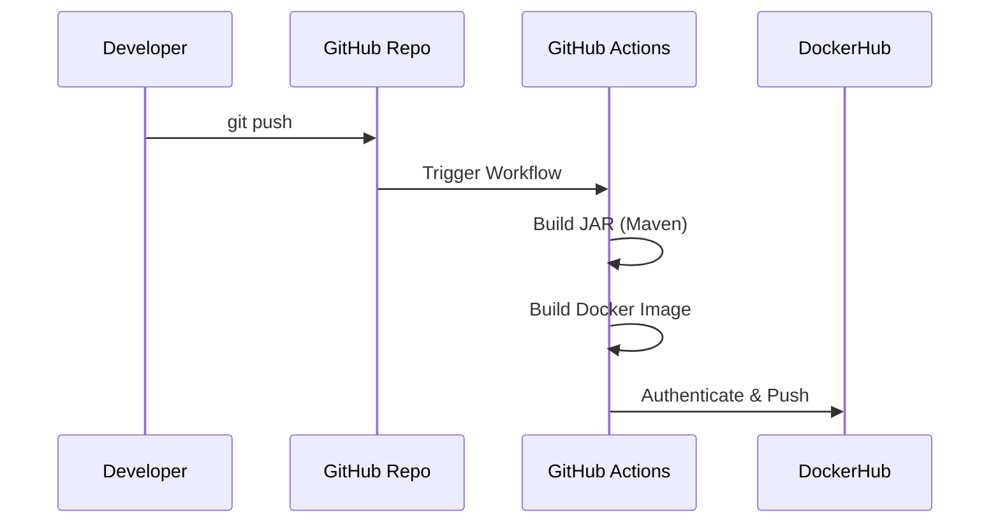

# 2. Building Jar And Docker Image

:::info
Instead of building manually on our local machine, we will utilize GitHub Actions to automatically compile our JAR file and build our Docker Image on every push!
:::

## Automated Pipeline Workflow

## Setting up GitHub Actions

### 1. Build JAR Pipeline
Set up a CI/CD pipeline to compile the JAR file automatically. 
*You can copy the template here:* 
[GitHub Template: buildjar.yml](https://github.com/hashcodes7/smallkart_customer/blob/master/.github/workflows/buildjar.yml)

### 2. Build Docker Image Pipeline
Set up a CI/CD pipeline to build the Docker image from the compiled JAR file.
*You can copy the template here:*
[GitHub Template: buildDockerImage.yml](https://github.com/hashcodes7/smallkart_customer/blob/master/.github/workflows/buildDockerImage.yml)

:::warning
But we have not connected our DockerHub to GitHub yet! The pipeline will fail without proper authentication. We need to do that by making a Docker account and injecting secure tokens.
:::

If you haven't created an account yet, follow the steps here: [Creating DockerHub Account](4-creating-dockerhub-account.md).