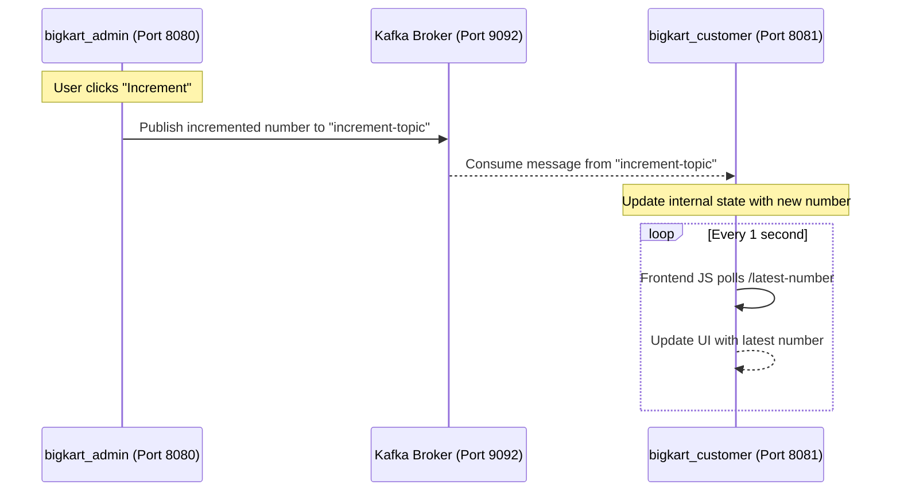

This document outlines the process and architecture for the asynchronous communication implemented between the `bigkart_admin` and `bigkart_customer` services using Apache Kafka.

  

## Architecture Overview

  

The system uses a Producer-Consumer pattern where the admin application generates events (incrementing a number) and the customer application consumes and displays these events.

  

  

## Implementation Details

  

### 1. Dependencies

Both `bigkart_admin` and `bigkart_customer` rely on the following key dependencies added to their respective `pom.xml` files:

- `spring-kafka`: For Spring Boot Kafka integration.

### 2. Admin Service (bigkart_admin)

The admin service acts as the **Producer**. It runs on the default port `8080`.

- **Properties (`application.properties`)**: Configured `spring.kafka.producer.bootstrap-servers=localhost:9092` to connect to the Kafka broker.

- **Service (`KafkaProducerService.java`)**: Utilizes `KafkaTemplate` to send the incremented number as a string to the `increment-topic`.

- **Controller (`AdminKafkaController.java`)**: Handles the HTTP GET request for the homepage and the POST request to increment the number and trigger the Kafka service.

- **Frontend (`admin-kafka.jsp`)**: Provides a simple UI with a button to increment and transmit the number.

  

### 3. Customer Service (bigkart_customer)

The customer service acts as the **Consumer**. It is configured to run on port `8081`.

- **Properties (`application.properties`)**: Configured to connect to Kafka, listen under the consumer group `bigkart-customer-group`, and run on `server.port=8081`.

- **Service (`KafkaConsumerService.java`)**: Uses `@KafkaListener` to listen to messages from the `increment-topic`. It parses the incoming string and updates its internal state representing the latest number.

- **Controller (`CustomerController.java`)**: Exposes a `/latest-number` endpoint that returns the current number stored in the service.

- **Frontend (`customer-kafka.jsp`)**: Uses JavaScript `fetch` to poll the `/latest-number` endpoint every 1 second and dynamically update the DOM with the new value, including a brief CSS animation.

  

## How to Run and Test

1. **Start Kafka**: Ensure the Kafka Broker is running locally on port `9092`.

2. **Start Admin App**: Run the `bigkart_admin` Spring Boot application. It will be accessible at `http://localhost:8080`.

3. **Start Customer App**: Run the `bigkart_customer` Spring Boot application. It will be accessible at `http://localhost:8081`.

4. **Test Flow**:

   - Open both URLs in separate browser windows.

   - Click the "Increment & Send" button in the admin window.

   - Observe the number automatically updating in the customer window.