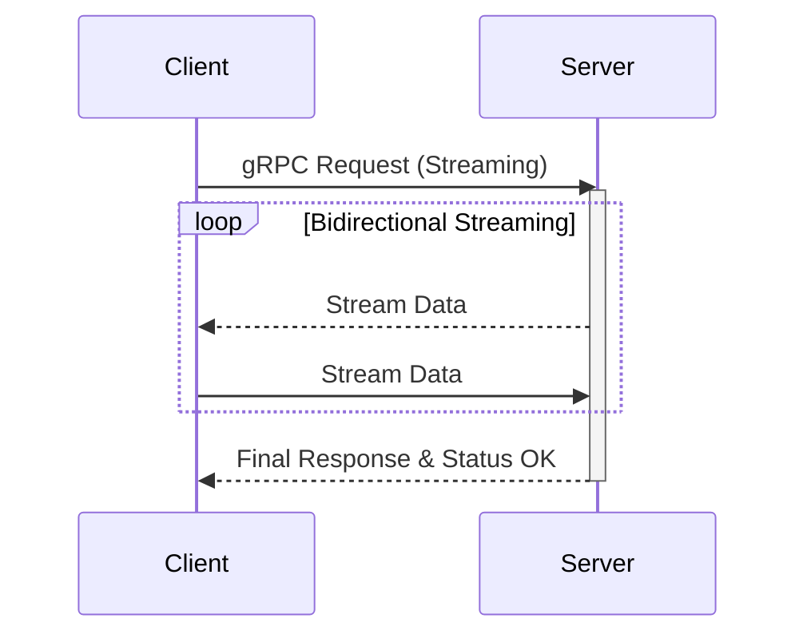

# gRPC in Distributed Systems

**gRPC** (gRPC Remote Procedure Call) is a high-performance, open-source framework developed by Google that is widely used in distributed systems to enable efficient, low-latency communication between services.

## Core Concept
In a distributed system, gRPC allows a client application to directly call a method on a server application located on a different machine as if it were a local object. This abstraction simplifies the complexity of network communication for developers.

## How It Works
* **Service Definition:** Developers define service contracts and data structures using **Protocol Buffers (Protobuf)**, which acts as an Interface Definition Language (IDL).
* **Code Generation:** Using the Protobuf definition, gRPC automatically generates client "stubs" and server-side code in various supported programming languages (e.g., Java, Python, Go, C++).
* **Transport Layer:** gRPC uses **HTTP/2** as its transport protocol, which supports features like multiplexing, header compression, and bidirectional streaming, making it significantly more efficient than traditional HTTP/1.1-based REST APIs.
* **Serialization:** It uses binary serialization (via Protobuf) instead of text-based formats like JSON or XML, resulting in smaller payload sizes and faster processing.

## Key Benefits in Distributed Systems
* **High Performance:** The combination of binary serialization and HTTP/2 reduces latency and CPU usage, making it ideal for high-throughput, low-latency environments.
* **Strong Typing & Contract-First:** The schema-driven nature of Protobuf ensures that service interfaces are clearly defined and strictly typed, which helps catch errors early and improves system reliability.
* **Language Agnostic:** Because it supports many languages, it is highly suitable for polyglot microservices architectures where different services may be written in different technologies.
* **Streaming Support:** gRPC supports multiple communication patterns, including unary (single request/response), client streaming, server streaming, and full bidirectional streaming, which is essential for real-time applications.

* **Scalability:** Built-in support for load balancing and efficient connection management allows systems to scale horizontally with ease.

## Common Use Cases
* **Microservices:** Facilitating fast, internal communication between different microservices.
* **Real-Time Systems:** Powering chat applications, real-time analytics, and data synchronization services where low latency is critical.
* **AI & High-Performance Computing:** Efficiently streaming data between client applications and model-serving infrastructure.
