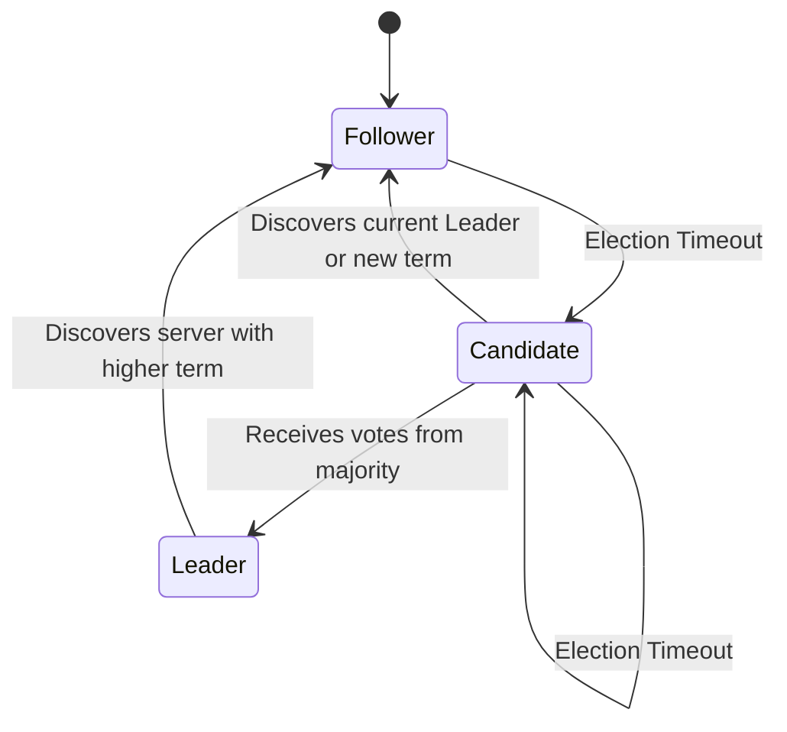

# Raft Consensus Algorithm

Raft is a consensus algorithm designed as an alternative to Paxos. It was meant to be more understandable than Paxos by means of separation of logic, but it is also formally proven safe and offers some additional features.

Raft offers a generic way to distribute a state machine across a cluster of computing systems, ensuring that each node in the cluster agrees upon the same series of state transitions.
