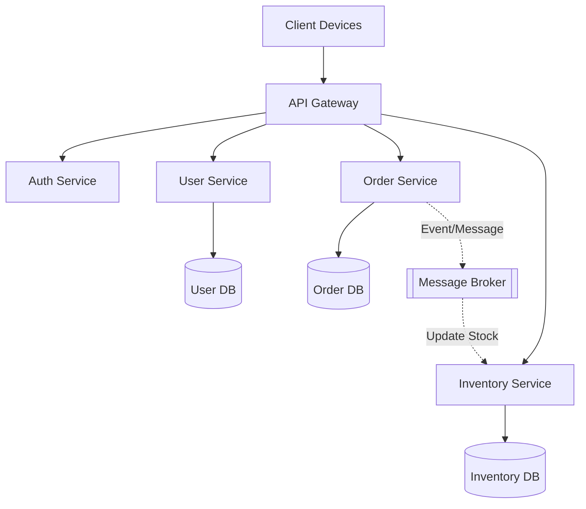

Microservices architecture is a design approach where an application is structured as a collection of small, autonomous services. Each service is self-contained, focuses on a specific business capability, and communicates via lightweight protocols, typically APIs.

### Core Principles
*   **Single Responsibility:** Each service handles one specific business function.
*   **Autonomy:** Services can be developed, deployed, and scaled independently.
*   **Loose Coupling:** Changes in one service should not necessitate changes in others.
*   **Decentralized Data:** Each service typically manages its own private database to ensure independence.
*   **Fault Isolation:** If one service fails, it does not necessarily bring down the entire system.

### Key Components
*   **API Gateway:** Acts as the single entry point for clients, handling routing, authentication, and rate limiting.
*   **Service Registry & Discovery:** Allows services to find and communicate with each other dynamically.
*   **Load Balancer:** Distributes incoming traffic across multiple instances of a service to ensure high availability.
*   **Circuit Breaker:** Prevents a failure in one service from cascading by "tripping" and failing fast when a dependency is down.
*   **Service Mesh:** Manages complex service-to-service communication, including security, observability, and traffic management.

### Communication Patterns
*   **Synchronous:** Services communicate in real-time (e.g., HTTP/REST, gRPC). The caller waits for a response, which can lead to tight coupling and potential latency issues.
*   **Asynchronous:** Services communicate via message brokers (e.g., Kafka, RabbitMQ). This pattern promotes better scalability and fault tolerance as it decouples the sender from the receiver.

### Data Management Strategies
Managing data in a distributed environment is one of the most challenging aspects of microservices.
*   **Database per Service:** Ensures services remain decoupled and can use different data storage technologies (polyglot persistence).
*   **Eventual Consistency:** Since distributed transactions (ACID) are difficult to implement across services, systems often rely on eventual consistency.
*   **Patterns for Consistency:**
    *   **Saga Pattern:** Manages distributed transactions by executing a sequence of local transactions with compensating actions if one fails.
    *   **CQRS (Command Query Responsibility Segregation):** Separates read and write operations to optimize performance and scalability.
    *   **Event Sourcing:** Stores state changes as a sequence of events, providing a reliable audit log and enabling state reconstruction.

### Benefits vs. Challenges
| Benefits | Challenges |
| :--- | :--- |
| Independent scalability | Increased operational complexity |
| Faster development cycles | Data consistency management |
| Technological flexibility | Distributed system debugging |
| Improved fault isolation | Inter-service communication overhead |
