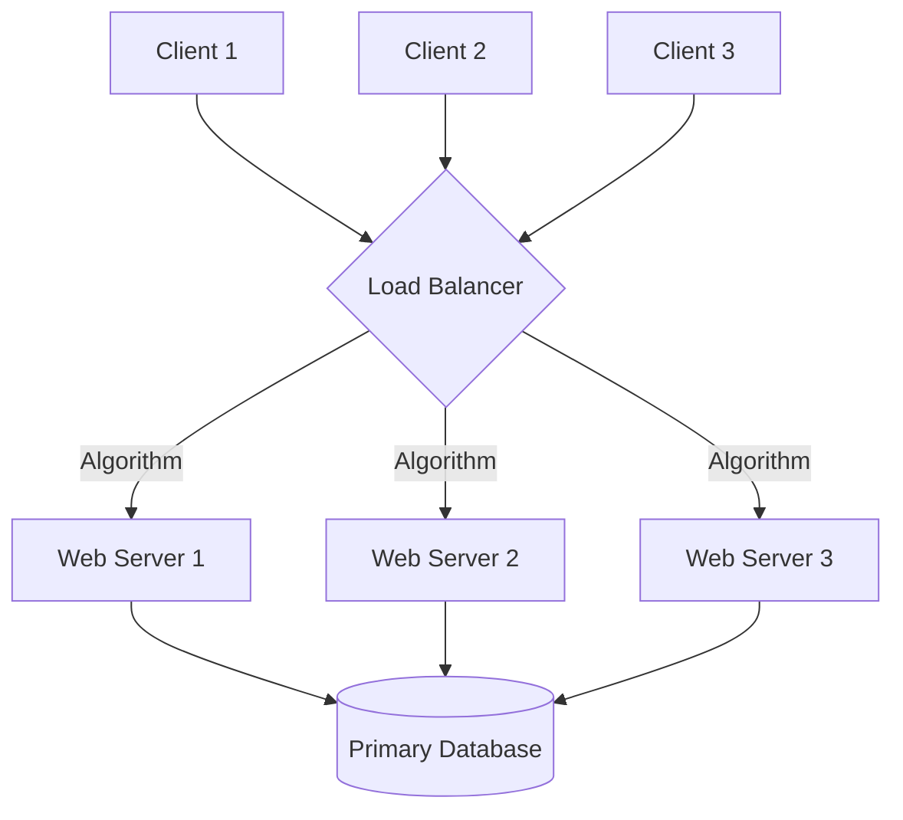

# Load Balancing

This module covers core concepts for system architecture and large-scale deployments.

Scalability, reliability, and proper technology choices are fundamental to modern cloud systems. Utilize caching, replication, and effective data stores for best results.
