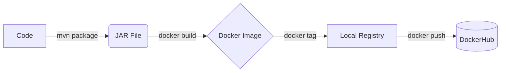

# 6. Building Docker Image

:::info
Now that you have created a Docker account and a repository using [Creating DockerHub Account & Repo](./5-creating-dockerhub-account-&-Repo.md), we will physically build the image.
:::

## Manual Build Workflow



Assuming your full repository reference is `hashcodes7/smallkart_customer:latest`, run the following command in your terminal to build the image:

```bash
docker build -t hashcodes7/smallkart_customer:latest .
```

### Breakdown of the Command
- `-t`: Tags the image with a name.
- `hashcodes7/smallkart_customer:latest`: The repository reference. This ensures DockerHub knows exactly where to push it later.
- `.`: The trailing dot tells Docker to look for the `Dockerfile` in the current directory.

Wait for the build to finish. It will look like this:


:::tip
Before pushing to production, you might want to test your image locally! See [Testing Docker Image Locally](./6.1-optional-testing-docker-image-locally-before-deploying.md).
:::

To directly move to deployment, go to [Logging in to DockerHub](./7-Logging-in-to-DockerHub.md).